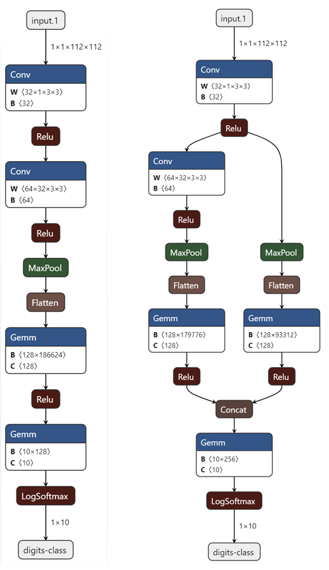
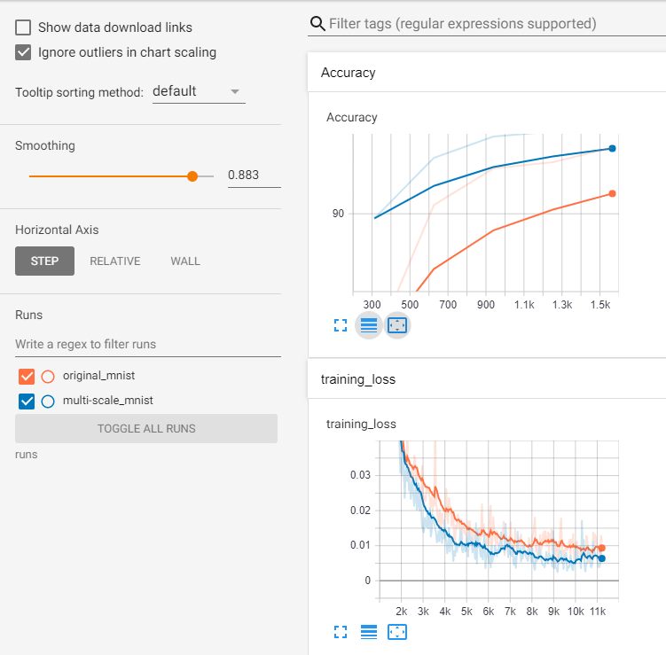

This is a simple example of how to design a neural network that learns to classify images at two different scale. The original MNIST dataset has been used to illustrate how well convolutional neural networks (CNNs) extract features and how we can build a decision boundary to classify digits. 

This example uses an extended MNIST dataset with two different scales of digits. We create this programatically.

First
```
    transform_resize = transforms.Compose([
        transforms.Resize(112),  # scale image to four times original
        transforms.ToTensor(),
        transforms.Normalize((0.1307,), (0.3081,))])
```
Second
```
    transform_pad = transforms.Compose([
        transforms.Pad(42),  # keep digits size the same but expand image
        transforms.RandomAffine(0, translate=(0.3, 0.3)),
        transforms.ToTensor(),
        transforms.Normalize((0.1307,), (0.3081,))])
```

### Sample Images
These sample images are at two different scales.

| Scaled Image                                              | Original Image with rest of area padded                   |
| ----------------------------------------------------------|---------------------------------------------------------- |
| | |


### The Two Nets
The net on the left is the original net adjusted for 112x112 dimensions in the last layer. The first convolutional layer has kernel size of 3x3, a stride of 1, and a dilation of 1.

`self.conv1 = nn.Conv2d(1, 32, 3, 1)`

The net on the right is modified in two ways:

First, we introduce a dilation of 2 to increase the receptive field. 

`self.conv1 = nn.Conv2d(1, 32, 3, 1, dilation=2)`

Second, we introduce a parallel branch learn a different scale, the intuition is that is learns the scaller digits.

Note, stride is step length for sliding 3x3 kernel and dilation is the step length for kernel element.




### TensorBoard Plots

